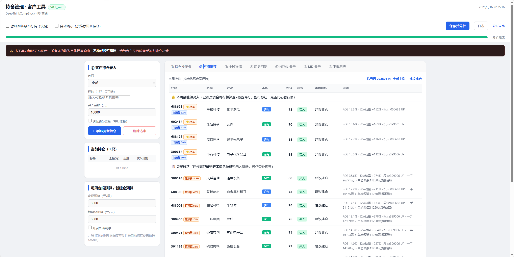
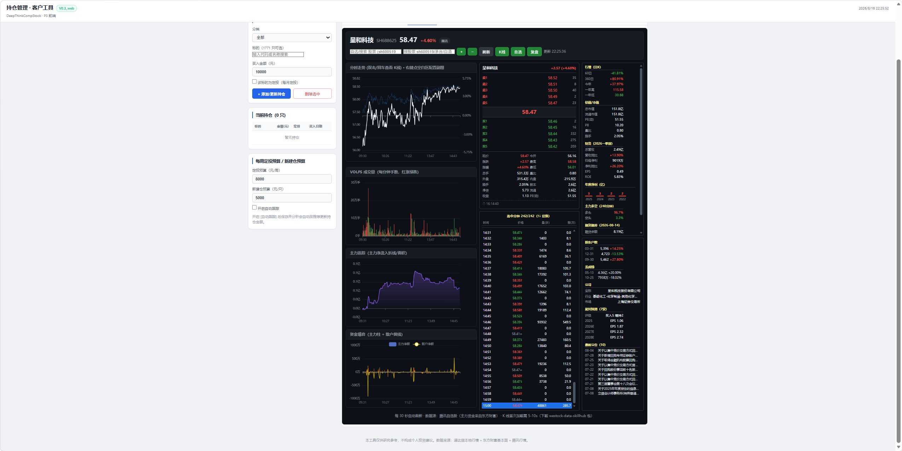
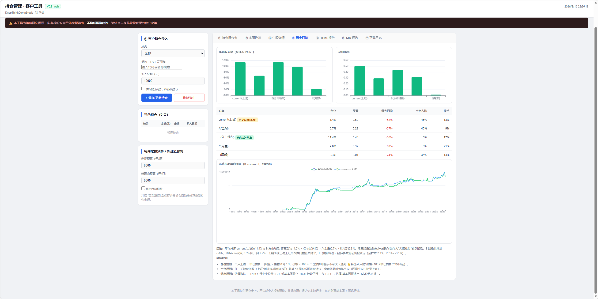
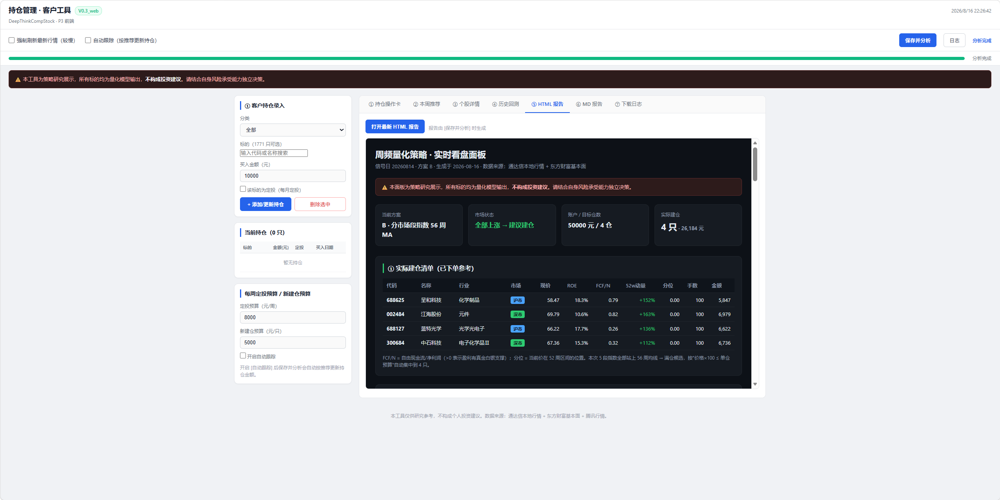

# DeepThinkCompStock · 持仓管理 · 客户工具

一站式 A 股工具：策略持仓管理 + 推荐选股 + **个股详情（100% 移植 deepthinkSingle 完整前端）**。

## 快速开始

```bash
# 依赖（4.6.x 已含 fastapi/uvicorn）
python -m pip install -r requirements.txt

# 启动（默认 8899）
python -m uvicorn server:app --host 127.0.0.1 --port 8899

# 浏览器打开
http://127.0.0.1:8899/
```

## 页面结构

- **侧栏**：持仓录入 / 当前 / 预算（client 客户工具）
- **Tab 路由**：拆解卡 · 本周推荐 · 个股详情 · 历史回测 …
- **本周推荐 → 个股详情**：点击推荐行代码，`#/stock/<code>?from=rec` 进入完整个股详情

### 功能截图

**① 本周推荐**（Tab 3）：左侧客户信息 + 选股规则；右侧滚动收益排行榜，含评级（市值/估值/PEG）/ROE/扣非增速/资产负债率等关键指标，命中字段红色高亮。



**② 个股详情**（完整移植 deepthinkSingle）：左列分时 + 副图（VOLFS 成交量、资金博弈主力净额+散户黄线）+ 近 5 日主力净流入；中列深色盘口（5 档卖/大字现价 58.47/5 档买/ob-stats 8 行×2 列实时数据）+ 逐笔成交；右列 13 个 mp-section（行情/估值/财务/年度净利/主力多空/融资融券/股东户数/龙虎榜/北向资金/公司/盈利预测/最新公告）。



**③ 历史回测**（Tab 4）：策略分区 5 段 + 实时净值曲线（含 50/150 日均线）+ 标准差/夏普/最大回撤 + 退换手/当前仓位/成交股票数 + 同期上证指数对照图。



**④ HTML 报告**：策略分组 + 净值/胜率柱状图 + 板块配比横向柱图 + 五只重点持仓股票详情表（代码/名称/板块/现价/涨跌/量比/扣非增速/ROE/资产负债率/PE/换手率/市场容量）+ 综合 KPI 解释与策略结论。



## 个股详情（deepthinkSingle 1:1 完整移植）

`static/js/modules/stock.js` 是薄壳：渲染 `single-template.js` 的完整 DOM，由 `single-app.js`（原 deepthinkSingle app.js）驱动。功能清单见 `docs/05-接口规范.md §6.4`，包括：

- 顶部状态栏 + 自选管理 + 搜索联想 + +/- 自选
- 分钟视图：分时 + 可配置副图（最多 5 个）、盘口（5档+大字现价+ob-stats 8行×2列）、逐笔成交（↑/↓ 切换）
- K线视图：7 周期（日/周/月/60/30/15/5）+ MA5/10/20 + 成交量 + dataZoom + K线副图（MACD/KDJ/BOLL/RSI）
- 历史分时小图（双击 K 线 / Enter）、分钟资金流明细、复盘记录、副图配置、右键菜单、导出 CSV、公告 modal
- 30s 自动刷新；A股红涨绿跌

## 数据源（四级免费降级）

腾讯行情 → 东方财富（资金/基本面）→ 通达信本地 → npx 兜底。含熔断/限流/退避/缓存。

## 后端 API（与 deepthinkSingle 契约一致）

`/api/quote`（聚合）、`/api/kline`、`/api/minute`、`/api/watchlist`、`/api/many`、`/api/search`、`/api/announcement`、`/api/analysis`（复盘）、`/api/stock/full`、`/api/stock/north`、`/api/stock/kline` 等。详见 `docs/05-接口规范.md`。

## 测试

```bash
# 前端 51 用例（node:test + jsdom）
node --test --test-force-exit tests/frontend/*.test.js

# 后端 174 用例
python -m unittest discover tests -p "test_*.py"
```

## 文档

`docs/`：01-PRD / 02-架构设计 / 03-UI设计规范 / 04-测试方案 / 05-接口规范 / 06-项目计划 / 07-决策问答记录
`docs/screenshots/`：4 张功能截图（推荐/个股详情/历史回测/HTML 报告）

---

> 本工具仅供研究参考，不构成个人投资建议。
