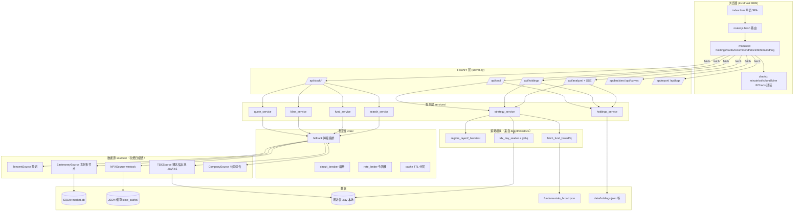

# DeepThinkCompStock · 架构设计

| 字段 | 值 |
|------|---|
| 文档版本 | v2.0（评审后修订） |
| 编写日期 | 2026-08-16 |
| 文档状态 | **待评审** |
| 配套文档 | [01-需求文档(PRD).md](./01-需求文档(PRD).md) |
| 架构师 | DeepThink 架构组（含评审意见） |

---

## 一、架构目标

整合 `deepthinkstock`（策略/持仓）与 `deepthinkSingle`（行情/稳定性）两个成熟系统的已验证代码，构建一站式平台，核心新增为**策略表 → 个股详情的一键衔接**。

**三条铁律**（来自 deepthinkSingle 的成功经验）：
1. **数据源四级免费降级**（腾讯→东财→通达信本地→npx），拒绝依赖收费 MCP
2. **稳定性组件前置**（熔断/限流/退避/缓存），防止数据源雪崩
3. **前后端分离 + 可测试**（Service 依赖 Source 抽象，数据源可 mock）

---

## 二、技术选型

| 层 | 选型 | 来源 | 理由 |
|----|------|------|------|
| 后端 | FastAPI + uvicorn | deepthinkstock | 已用，异步+SSE+Swagger |
| 前端 | 原生 ES Modules + ECharts + Chart.js | 两者 | 无构建链，已验证 |
| 路由 | hash 路由（`#/stock/<code>`） | 新增 | 零依赖承接单页跳转 |
| 稳定性 | circuit_breaker / rate_limiter / fallback / cache | **deepthinkSingle core/** | 已 132 测试验证 |
| 数据源 | tencent / eastmoney / tdx / npx | **deepthinkSingle sources/** | 四级降级已验证 |
| 策略 | regime_layer2_backtest / tdx_day_reader | **deepthinkstock** | 质量+动量+Regime |
| 存储 | 本地 JSON + SQLite + 通达信 .day | 两者 | 单用户本地 |
| 行情 MCP | 通达信 MCP（可选第 5 级，默认关） | — | 收费，仅用户已有积分时启用 |

---

## 三、系统架构图



---

## 四、分层设计

### 4.1 Web 层（server.py，薄）
- 只做路由注册 + 参数校验 + JSON 序列化 + SSE
- 业务全委托 services/*
- 统一错误：HTTP 200 + `{"error": "..."}`（前端友好）

| 路由 | 方法 | 说明 |
|------|------|------|
| `/api/pool?cls=` | GET | 标的下拉池（1771 只） |
| `/api/holdings` | GET/POST | 持仓列表/添加更新 |
| `/api/holdings/delete` | POST | 批量删除 |
| `/api/settings` | GET/POST | 设置（auto_track/weekly/newpos/cash/N） |
| `/api/analyze` | POST | 保存并分析（后台线程） |
| `/api/analyze/status` | GET | 进度（或 SSE `/api/analyze/stream`） |
| `/api/backtest` `/api/curves` | GET | 回测汇总/净值曲线 |
| `/api/compare` | GET | 本周 vs 上周 |
| `/api/action_log` | GET | 自动调仓记录 |
| `/api/logs` `/api/logs/download` | GET | 日志/下载 |
| `/api/report/md?download=` | GET | MD 报告 |
| `/report/latest` | GET | 最新 HTML 报告 |
| `/api/search?q=` | GET | 股票搜索（全 A 股 5549+） |
| **`/api/stock/quote`** | GET | 行情概况（16+ 指标） |
| **`/api/stock/tick`** | GET | 分时（240 根） |
| **`/api/stock/orderbook`** | GET | 五档盘口 |
| **`/api/stock/flow`** | GET | 订单流（近似逐笔） |
| **`/api/stock/fund_flow`** | GET | 资金博弈（主力/散户/大单） |
| **`/api/stock/fundamentals`** | GET | 财务摘要（5 年） |
| **`/api/stock/shareholders`** | GET | 股东户数 |
| **`/api/stock/news`** | GET | 新闻公告 |
| **`/api/stock/kline`** | GET | 历史 K 线（period/limit） |

### 4.2 服务层（services/*）

| 服务 | 职责 | 依赖 |
|------|------|------|
| `quote_service` | 拉报价+分时，Source 失败降级，组装 16+ 指标 | tencent → eastmoney |
| `kline_service` | 周期归一化，本地优先 | tdx → npx → eastmoney |
| `fund_service` | 主力资金（东财多节点轮换） | eastmoney push2 → push2delay |
| `search_service` | 预置池模糊 → 在线兜底 | stock_list.json + npx |
| `strategy_service` | 策略分析（B 方案），持仓卡/推荐生成 | regime_layer2_backtest |
| `holdings_service` | 持仓 CRUD + 自动跟踪 | holdings.json |
| `market_service` | 个股详情 8 类数据聚合（并发 + 缓存） | 上述全部 |

### 4.3 数据源层（sources/*，核心抽象）

```python
# sources/base.py
class Source(ABC):
    name: str
    @abstractmethod
    def get_quote(self, code) -> dict: ...
    @abstractmethod
    def get_minute(self, code) -> list: ...
    @abstractmethod
    def get_kline(self, code, period, limit) -> list: ...
    @abstractmethod
    def get_fund_flow(self, code) -> list: ...
```

**降级编排**（core/fallback.py）：
```python
def with_fallback(sources, method, *args, **kwargs):
    last_err = None
    for s in sources:
        try:
            return getattr(s, method)(*args, **kwargs)
        except Exception as e:
            last_err = e
    raise RuntimeError(f"全部数据源失败: {last_err}")
```

**优先级链**（config.py，与 deepthinkSingle 一致）：

| 数据 | 优先级链 | 缓存 TTL |
|------|---------|---------|
| 报价 | tencent → eastmoney | 10s |
| 分时 | tencent → eastmoney | 30s |
| 主力资金 | eastmoney(push2) → push2delay | 60s |
| 日/周/月 K | tdx 本地 → npx → eastmoney | 24h（JSON） |
| 分钟 K | tdx .lc1 聚合 → npx → eastmoney | 24h（JSON） |
| 财务/股东 | eastmoney datacenter → 同花顺 | 600s |
| 新闻 | eastmoney 公告 → 同花顺 | 1800s |

### 4.4 稳定性（core/*，来自 deepthinkSingle）

```
请求 → 熔断器(开/关/半开) → 限流器(令牌桶) → 数据源
          ↑ 连续失败≥5 → 熔断 60s     ↑ 超阈值 → 排队/降级
```

| 机制 | 参数（config.py） | 已验证 |
|------|-------------------|--------|
| 超时 | HTTP_TIMEOUT=5s，TOTAL=12s | ✅ |
| 熔断 | CIRCUIT_FAILS=5，RESET_S=60，HALF_OPEN=1 | ✅ |
| 限流 | RATE_LIMIT_EM=2/s，TX=5/s | ✅ |
| 退避 | RETRY_MAX=3，(1,2,4)s | ✅ |
| 多节点 | EM_HOSTS=[push2, push2delay, push2his] | ✅ |
| 降级缓存 | stale-while-revalidate | ✅ |

### 4.5 策略模块（来自 deepthinkstock）

```
modules/strategy/
├── regime_layer2_backtest.py   # 核心引擎（5 方案 + current_candidates）
├── tdx_day_reader.py           # 通达信 .day 读取 + gbbq 前复权
├── live_compare.py             # 本周 vs 上周
├── dump_curves.py              # 回测指标 + 净值曲线
├── build_dashboard.py          # HTML 报告生成
└── fetch_fund_broad.py / bj.py # 基本面（季度）
```

**已修复的关键 bug**（迁移时保留）：
- B 方案段指数缺失 → 回退父指数门控（非无脑放行）
- 北证 50 周线不足 → min_weeks=60 参数化
- 前复权 gbbq 解码（自定义 Feistel 密码）

### 4.6 前端架构

```
static/js/
├── app.js                # 主入口：侧栏 + Tab 布局 + 全局状态
├── router.js             # hash 路由（#/stock/<code> 承接详情）
├── modules/              # 按 Tab 分模块，import() 按需加载
│   ├── holdings.js       #   持仓录入/当前/预算
│   ├── cards.js          #   持仓操作卡（代码可点击）
│   ├── recommend.js      #   本周推荐（⭐精选/📋更多候选，代码可点击）
│   ├── stock.js          #   个股详情（8 卡片 + 5s/10s 轮询）
│   ├── bt.js             #   历史回测（柱状图 + 净值曲线）
│   ├── html.js / md.js   #   报告
│   └── log.js            #   日志（级别着色 + 筛选）
└── charts/               # ECharts 封装（来自 deepthinkSingle）
    ├── minute.js / volfs.js / fund.js / kline.js
```

**跳转衔接（核心）**：
```javascript
// recommend.js 中
function bindCodeLinks(container) {
  container.querySelectorAll('td[data-code]').forEach(td => {
    td.classList.add('clickable');
    td.onclick = () => {
      location.hash = `#/stock/${td.dataset.code}?from=rec`;
      window.scrollTo(0, 0);
    };
  });
}
// stock.js 中
function backFromStock() {
  const from = new URLSearchParams(location.hash.split('?')[1]).get('from') || 'rec';
  location.hash = `#/${from}`;
}
```

---

## 五、数据流（个股详情）

```
用户点击"688625 呈和科技"
   │
   ▼
location.hash = '#/stock/sh688625?from=rec'
   │
   ▼
router.js 分发 → import('./modules/stock.js')
   │
   ▼
stock.js loadStockDetail('sh688625'):
   │
   ├── Promise.all([quote, tick, orderbook, flow, fund_flow, fund, holders, news])
   │      ↓ 各自走 services → fallback → sources（四级降级）
   │      ↓ 失败项返回 {error} → 前端显示占位
   │
   ├── renderAllCards(...)   # 8 卡片一次性渲染
   │
   └── setInterval 5s: 刷新 quote/orderbook
        setInterval 10s: 刷新 flow/fund_flow
   │
   ▼
用户点"← 返回" → backFromStock() → hash = '#/rec'
```

---

## 六、缓存与数据一致性

| 缓存 | 存储 | TTL | 说明 |
|------|------|-----|------|
| 行情报价 | 内存 TtlCache | 10s | 避免轮询打爆数据源 |
| 分时 | 内存 | 30s | |
| 主力资金 | 内存 | 60s | |
| 分钟 K 线 | JSON `data/kline_cache/` | 24h | 避免 npx 重复调用 |
| 历史 K | 通达信 .day（权威）+ SQLite | 持久 | 本地优先 |
| 财务/股东 | 内存 | 600s | 盘后刷新即可 |
| 新闻 | 内存 | 1800s | |
| 持仓/设置/调仓 | JSON 原子写 | 持久 | .tmp + rename |

SQLite 表（沿用 deepthinkSingle）：
```sql
CREATE TABLE kline_cache (code TEXT, period TEXT, ts INTEGER, data TEXT, PRIMARY KEY(code, period));
CREATE TABLE analysis_log (id INTEGER PRIMARY KEY, ts INTEGER, code TEXT, data TEXT);
```

---

## 七、部署架构

```
E:\AI_Studio\
├── deepthinkstock\            # 老项目（迁移后保留，标注 deprecated）
├── deepthinkSingle\           # 老项目（行情，迁移后保留）
└── deepthinkcomp_stock\       # 新项目（本架构）
    ├── server.py
    ├── config.py
    ├── core/ sources/ services/ modules/
    ├── static/ data/ tests/
    └── start.bat  →  uvicorn server:app --host 0.0.0.0 --port 8899
```

**启动**：`start.bat`（先杀 8899 旧进程 → 依赖检查 → 启动 → 开浏览器）

**资源估算**：
- 代码 ~5000 行（Python 2500 + JS 2000 + CSS 500）
- 运行时内存 ~600MB（FastAPI + 缓存）
- 磁盘 ~300MB（数据 + 缓存 + 日志）

---

## 八、迁移策略

| 步骤 | 内容 | 来源 | 验证 |
|------|------|------|------|
| 1 | core/ 稳定性组件 | deepthinkSingle | 132 测试跑通 |
| 2 | sources/ 数据源适配器 | deepthinkSingle | `python -m unittest tests -v` |
| 3 | strategy/ 策略模块 | deepthinkstock | `dump_curves.py` 数字一致 |
| 4 | server.py API 整合 | 两者 | curl 全部路由 200 |
| 5 | static/ 前端整合 + router | 两者 + 新增 | 浏览器端到端 |
| 6 | modules/stock.js 详情页 | deepthinkSingle 前端改造 | 8 卡片渲染 |
| 7 | 删除老项目引用 | — | 回归测试 |

---

## 九、扩展性设计（架构师评审补充）

1. **注册表而非 if-else**：数据源/指标/面板用注册表 + 配置驱动
2. **接口契约先行**：Source/Indicator/Panel 先定义接口
3. **批量聚合**：`/api/quote?codes=a,b,c` 服务端 ThreadPoolExecutor(8) 并发，为自选批量预留
4. **多市场**：code 前缀路由（sh/sz→A股，hk→港股预留，us→美股预留）
5. **指标引擎**：indicators/ MA/EMA/MACD/KDJ/RSI/BOLL 可插拔（deepthinkSingle 已有 indicators.js 前端版）

---

## 十、架构决策记录（ADR）

| ADR | 决策 | 备选 | 理由 |
|-----|------|------|------|
| ADR-1 | 行情免费四级链 | 通达信 MCP（收费） | 成本零 + deepthinkSingle 已验证；**MCP 降为第 5 级最后兜底**（用户仅 1 万积分） |
| ADR-2 | 原生 JS + ECharts | Vue3 全家桶 | 无构建链 + 128 测试验证；**用户已确认采纳** |
| ADR-3 | hash 路由 | Vue Router | 零依赖 + 满足单页详情跳转 |
| ADR-4 | 单进程 + 后台线程 | Celery | 单用户无并发需求 |
| ADR-5 | JSON 原子写 | 数据库事务 | 数据量小 + 简单可靠 |
| ADR-6 | 复用不重写 | 从零重构 | 两个老项目代码质量已验证（测试 100% 通过） |
| ADR-7 | 个股详情 8 卡全量 | 3 卡先交付 | deepthinkSingle 8 卡已验证可用，迁移≈0；仅新增跳转衔接 |

---

## 十一、评审意见（专家团队）

### 架构师
- 分层清晰，稳定性前置（core/ 先于业务），复用已验证代码风险最低
- **建议**：P1 阶段必须先跑通"四级降级链"（模拟断网场景），这是全系统地基

### 全栈工程专家
- sources/ 字段映射集中封装（腾讯 GBK 解析、东财多节点）需保留 deepthinkSingle 的 10 类修复经验注释
- **关键**：前端 `import()` 按需加载必须在 P1 就落地，避免详情页 JS 拖慢首屏
- config.py 所有参数外置（数据源开关/优先级/TTL/限流），改配置不改代码

### 测试专家
- 迁移后测试基线：core 132 例 + 前端 15 例必须 100% 通过才能进 P2
- 新增测试：详情页 8 卡片渲染（jsdom）、跳转路由回归、降级链 mock 测试

### 评审专家
- 架构与 PRD 对齐（D2 免费链、D4 原生 JS 均已体现）
- **待确认**：ADR-2 是否接受（若用户要 Vue3，架构需调整前端层但后端不动）

---

## 十二、待确认

1. ADR-1~6 是否全部接受？
2. 前端"原生 JS + ECharts"是否确认（否决 Vue3）？
3. P1 先做"数据源四级链 + 骨架"是否同意？

---

*本架构基于 deepthinkstock 与 deepthinkSingle 两个已交付系统的实际架构与实现编写。*
---

## 十三、个股详情完整移植架构（2026-08-17 定稿）

### 13.1 决策：不做"自研三列"，直接复用 deepthinkSingle 完整前端

用户明确要求"个股详情一定要按照 deepthinkSingle 里面所有功能一样做"。为避免重复实现 1800 行交互逻辑（副图配置/资金流明细/复盘/历史分时/右键菜单/导出 CSV），**架构改为：薄壳 + 原样复用**。

### 13.2 模块结构

```
static/js/modules/
├── stock.js                # 薄壳（~2KB）：渲染 SINGLE_HTML + boot window.__SINGLE_APP__
├── single-template.js      # SINGLE_HTML（8KB）：deepthinkSingle index.html <body> 提取
├── single-app.js           # （92KB）：deepthinkSingle app.js 原样，IIFE 挂 window.__SINGLE_APP__
│                            #   仅改尾部：boot/setCode/getView/switchToKline/switchToMinute/cleanup/reset
│                            #   另加 renderMarketPanel 北向资金 section（扩展）
├── single-indicators.js    # （3.5KB）：deepthinkSingle indicators.js，挂 window.DTIndicators
│                            #   MACD(12,26,9)/KDJ(9)/BOLL(20,2)/RSI(14) 纯算法
static/css/
└── stock.css               # 526 行：#pane-stock 前缀隔离的完整深色主题
                            #   = 原 stock.css + single-style.css 缺失部分（modal/ctx/analysis/sub-config/fund-flow/wl-table/search）
```

### 13.3 数据契约（与 deepthinkSingle 一致）

- `/api/quote` 返回聚合形状 `{quote, minute, fund, stats, finance, profit_trend, holders, company, forecast, margin, lhb, announcements, day5_funds, sentiment, north, errors}`（svc.get_all）
- 新增 `/api/analysis`（复盘记录，持久化 data/analysis.json）
- 新增 `north` 字段（北向资金，sources/company.get_north_holding，报表 RPT_MUTUAL_HOLDSTOCKNORTH_STA）

### 13.4 好处 / 风险

- **好处**：deepthinkSingle 全部已验证功能 100% 复用，无重新实现风险；前端 51 + 后端 174 测试全绿
- **风险**：single-app.js 是 IIFE 全局闭包，与 deepthinkcomp_stock 的 tab 路由并存（无 id 冲突，已核对）；后续 deepthinkSingle 升级前端时需同步复制
